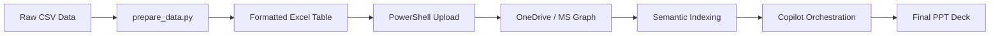

# Executive-Reporting-Automation: AI-Driven M365 Orchestration

[](STATUS.md)
[](https://www.microsoft.com/en-us/microsoft-365/copilot)
[](scripts/)

## 🚀 Overview
This repository shows a production-level workflow for transforming raw sales data into business-relevant presentations and documents. It leverages **Microsoft 365 Copilot**, **Microsoft Graph**, and a **retrieval-augmented generation (RAG)** architecture.

This project specifically solves the challenge of data grounding for LLMs by programmatically structuring Excel data into a format that Copilot can reliably index and analyze.

### Project Context: 
This project is the **Phase 2** evolution of my cloud infrastructure journey. While the previous project focused on building the "Foundations," this phase focuses on "Intelligence and Automation."
- **Phase 1**: [Azure Intune Lab: https://github.com/LuciaCode/azure-intune-lab]
Focus: Established the core Azure Infrastructure, Entra ID (Azure AD) identity governance, and Microsoft Intune- Microswoft Defender endpoint management.
- **Phase 2**: Executive Reporting Automation (This Repository)
Focus: Leveraging the Phase 1 infrastructure to deploy Python-based data pipelines and orchestrate Microsoft 365 Copilot for AI-driven business intelligence.

## 🏗️ Technical Architecture & Retrieval-Augmented Generation (RAG)
The solution follows a structured pipeline from local data preparation to cloud-based AI orchestration:




### Key Components
- **Data Layer:** Automated conversion of CSV to Copilot-ready Excel Tables (`Ventas_2024`) with metadata grounding.
- **Intelligence Layer:** M365 Copilot utilizing the **Semantic Index** to perform deep-tissue analysis of sales trends.
- **Presentation Layer:** A "Bridge" strategy using Word to synthesize raw data into a narrative before generating the final PowerPoint deck.

## 📂 Repository Structure
```text
├── scripts/                # Data transformation (Python) and Sync (PowerShell)
├── docs/                   # Deep-dive POC documentation and RAG architecture
├── data/                   # Raw sales datasets (CSV)
├── README.md               # Main project entry point
├── SETUP.md                # Environment & Deployment guide
├── STATUS.md               # Real-time project milestones
└── requirements.txt        # Python dependency manifest
```

## 🛠️ Environment Setup & Prerequisites
This solution was designed and tested on an Azure Virtual Machine. Clone this repo to your Windows 11 Azure VM.

To align this POC with enterprise standards, Microsoft Intune was leveraged to automate the deployment of the Microsoft 365 Apps for business (Word, Excel, PowerPoint...) to the managed endpoints.

### Deployment of the Microsoft 365 Apps Strategy:
1. Application Packaging: Utilized the Microsoft 365 Apps suite for Windows 10 and later via the Microsoft Intune Admin Center.
2. Configuration Profile:
- Update Channel: Configured to the Current Channel to ensure immediate access to the latest AI/Copilot feature updates.
- Architecture: Standardized on 64-bit for optimal performance of AI-driven data processing in Excel.
3. Silent Installation: Apps were assigned as Required to the user group, ensuring that as soon as the Azure VM joined the tenant, the tools were deployed in the background without user intervention.

  
[Microsoft 365 applications packaging via the Microsoft Intune Admin Center. Remote desktop connection]


### 1. Install Core Dependencies (Windows Package Manager):
Ensure Git and Python are installed at the system level:

```bash
winget install --id Git.Git -e --source winget
winget install --id Python.Python.3.12 -e --source winget
```
(Note: Restart PowerShell after installation to refresh the system Path).

### 2. Isolate the Environment (Best Practice):
Create and activate a Python Virtual Environment to prevent global package conflicts:

```bash
python -m venv venv
.\venv\Scripts\Activate.ps1
pip install -r requirements.txt
```
### 3. Install Microsoft Graph PowerShell SDK:

```bash
Install-Module Microsoft.Graph -Scope CurrentUser -Force
```


[Identity Management: Authenticating the Microsoft Graph Command Line Tools with specific 'Files.ReadWrite' scoped permissions for secure data handling.]


### Automated Deployment
Follow the instructions in [SETUP.md](SETUP.md) to upload your file to OneDrive using the **Microsoft Graph PowerShell SDK**.

### AI Orchestration
Once synced, use the specialized prompts found in [POC_Documentation.md](docs/POC_Documentation.md) within Excel, Word, and PowerPoint.

## 📈 Success Metrics (KPIs)
- **Efficiency:** 85% reduction in manual deck creation time.
- **Accuracy:** Zero-hallucination grounding via the `Ventas_2024` Table structure.
- **Consistency:** Unified corporate branding and narrative across all generated slides.

## 👤 Author
**Your company user**  
Project Lead for Juan Perez (Azure VM Environment)

## The Value Proposition
By programmatically converting raw CSVs into formatted Excel Tables and deploying them via the Microsoft Graph API, we bridge the gap between "Raw Information" and "AI Understanding." This workflow doesn't just save time—it establishes a secure Source of Truth, enabling high-value AI capabilities while maintaining strict corporate data governance.

---
*Disclaimer: This project requires an active Microsoft 365 Copilot license and appropriate tenant permissions for Microsoft Graph API access.*
