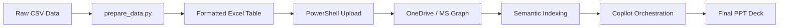

# Executive-Reporting-Automation: AI-Driven M365 Orchestration

[](STATUS.md)
[](https://www.microsoft.com/en-us/microsoft-365/copilot)
[](scripts/)

## 🚀 Overview
This repository demonstrates a production-grade workflow for transforming raw, disconnected sales data into executive-ready presentations. By leveraging **Microsoft 365 Copilot**, **Microsoft Graph**, and a **Retrieval-Augmented Generation (RAG)** architecture, we automate the "last mile" of business intelligence.

This project specifically solves the challenge of data grounding for LLMs by programmatically structuring Excel data into a format that Copilot can reliably index and analyze.

## 🏗️ Technical Architecture
The solution follows a structured pipeline from local data preparation to cloud-based AI orchestration:



### Key Components
- **Data Layer:** Automated conversion of CSV to Copilot-ready Excel Tables (`Ventas_2024`) with metadata grounding.
- **Intelligence Layer:** M365 Copilot utilizing the **Semantic Index** to perform deep-tissue analysis of sales trends.
- **Presentation Layer:** A "Bridge" strategy using Word to synthesize raw data into a narrative before generating the final PowerPoint deck.

## 📂 Repository Structure
```text
├── scripts/                # Data transformation (Python) and Sync (PowerShell)
├── docs/                   # Deep-dive POC documentation and RAG architecture
├── data/                   # Raw sales datasets (CSV)
├── README.md               # Main project entry point
├── SETUP.md                # Environment & Deployment guide
├── STATUS.md               # Real-time project milestones
└── requirements.txt        # Python dependency manifest
```

## 🛠️ Quick Start

### 1. Environment Setup
Clone this repo to your Windows 11 Azure VM and install dependencies:
```bash
pip install -r requirements.txt
```

### 2. Data Transformation
Execute the Python script to generate the formatted Excel file:
```bash
python scripts/prepare_data.py data/sales_data_2024.csv Sales_2024_Formatted.xlsx
```

### 3. Automated Deployment
Follow the instructions in [SETUP.md](SETUP.md) to upload your file to OneDrive using the **Microsoft Graph PowerShell SDK**.

### 4. AI Orchestration
Once synced, use the specialized prompts found in [POC_Documentation.md](docs/POC_Documentation.md) within Excel, Word, and PowerPoint.

## 📈 Success Metrics (KPIs)
- **Efficiency:** 85% reduction in manual deck creation time.
- **Accuracy:** Zero-hallucination grounding via the `Ventas_2024` Table structure.
- **Consistency:** Unified corporate branding and narrative across all generated slides.

## 👤 Author
**Senior M365 Solutions Architect**  
Project Lead for Juan Perez (Azure VM Environment)

---
*Disclaimer: This project requires an active Microsoft 365 Copilot license and appropriate tenant permissions for Microsoft Graph API access.*
