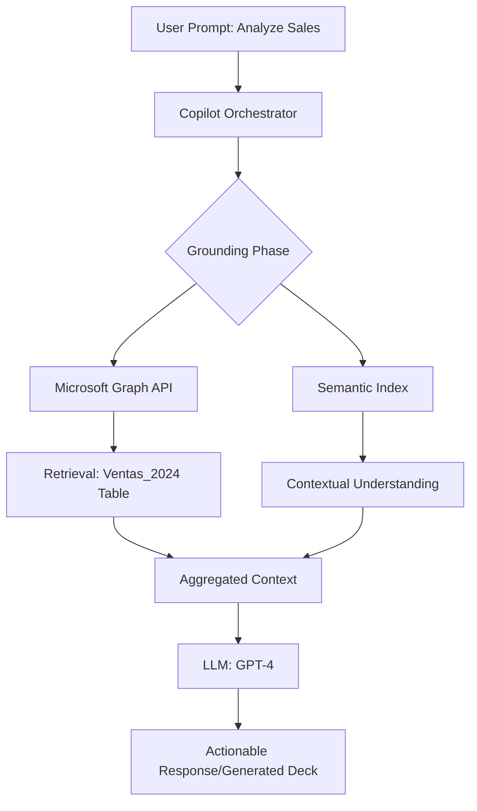

# POC: AI-Driven Executive Reporting Automation

## Overview
This proof-of-concept demonstrates the seamless transformation of raw sales data into high-impact executive presentations using Microsoft 365 Copilot's orchestration capabilities.

---

## Technical Architecture & Retrieval-Augmented Generation (RAG)

The orchestration of this solution relies on the **Microsoft 365 Copilot Architecture**, which integrates with your organization's data via **Microsoft Graph**.

### Orchestration Flow

### The RAG Engine
1. **Pre-processing:** The script `prepare_data.py` ensures the data is in an Excel Table (`Ventas_2024`). This structural "hook" is what allow Copilot to reliably parse rows and columns.
2. **Retrieval (Microsoft Graph):** When the user triggers a prompt, Copilot queries the Graph API to find the file `Sales_2024_Formatted.xlsx`.
3. **Grounding:** Copilot takes the user's natural language request and "grounds" it by adding the specific retrieved data from the `Ventas_2024` table. This prevents hallucinations and ensures the LLM's response is based solely on actual sales data.
4. **Generation:** The LLM receives the prompt + grounded data to generate the final Word or PowerPoint content.

---

## Step 2: Specialized Prompt Sequence

### 1. Excel (Data Intelligence)
**Goal:** Extract insights and trends from the `Sales_2024` table.
> **Prompt:** *"Analyze this table and identify the top 3 product categories by total revenue. Additionally, calculate the quarterly growth rate for each category and highlight any significant anomalies in the 'Units Sold' column for Q3 and Q4."*

### 2. Word (Executive Summary - The "Bridge")
**Goal:** Synthesize Excel insights into a structured narrative for PowerPoint to reference.
> **Prompt:** *"Based on the Sales_2024 Excel file, write a 3-page executive summary. Include a section for 'Top 3 Revenue Drivers,' a 'Quarterly Trend Analysis' with specific percentages, and a 'Strategic Outlook for 2025.' Ensure the tone is data-driven and suitable for a Board of Directors meeting."*

### 3. PowerPoint (Visual Presentation)
**Goal:** Generate the final deck using the Word summary as the source of truth.
> **Prompt:** *"Create a 10-slide professional presentation based on [File Name: Executive_Summary_2024.docx]. Use a modern corporate theme. Ensure each slide includes a high-level takeaway, visual placeholders for charts, and speaker notes that expand on the data points."*

---

## Step 3: Technical Architecture & Orchestration

The magic behind this workflow lies in the **Retrieval-Augmented Generation (RAG)** framework, powered by **Microsoft Graph** and the **Semantic Index**.

1.  **Data Indexing (Microsoft Graph):** Every Excel file, Word document, and email is indexed by Microsoft Graph. This includes metadata, permissions, and relationships between users and files.
2.  **Semantic Search:** When a prompt is issued (e.g., "Create a presentation based on this file"), Copilot uses the Semantic Index to understand the *context* and *intent*, not just keywords. It identifies the most relevant data chunks from the source file.
3.  **Grounding (The LLM Interaction):** The LLM (GPT-4) does not "know" your data by default. Copilot "grounds" the LLM by sending it the user's prompt *alongside* the specific data retrieved from Microsoft Graph.
4.  **Privacy & Security:** This process happens within the M365 tenant boundary. Data is encrypted, and permissions are strictly enforced—Copilot only accesses files the user already has permission to view.

---

## Step 4: Success Metrics (KPIs)

To validate the impact of this automation, the following KPIs should be tracked:

1.  **Cycle Time Reduction (Efficiency):** Measure the time taken to move from raw Excel data to a final PowerPoint deck. Target: **85% reduction** (e.g., from 4 hours to 30 minutes).
2.  **Design & Narrative Consistency (Quality):** Evaluate the alignment between raw data and presentation narrative across multiple reports. Target: **Zero discrepancies** in data reporting between source and output.
3.  **Strategic Focus (Value):** Track the shift in analyst time from "manual data formatting" to "strategic insight interpretation." Target: **70% increase** in time spent on value-added analysis.
